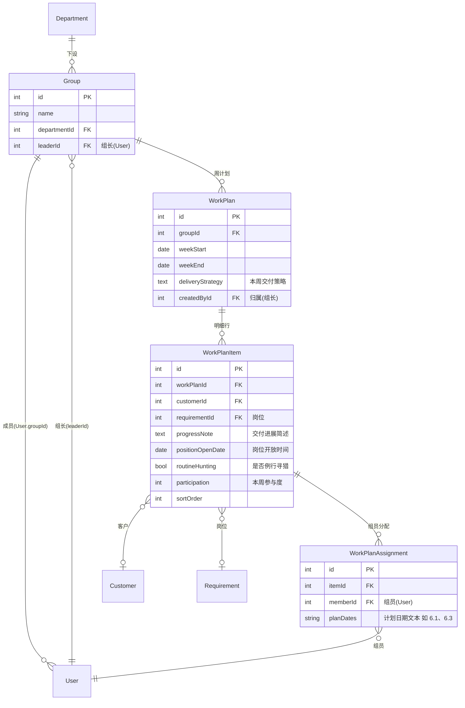
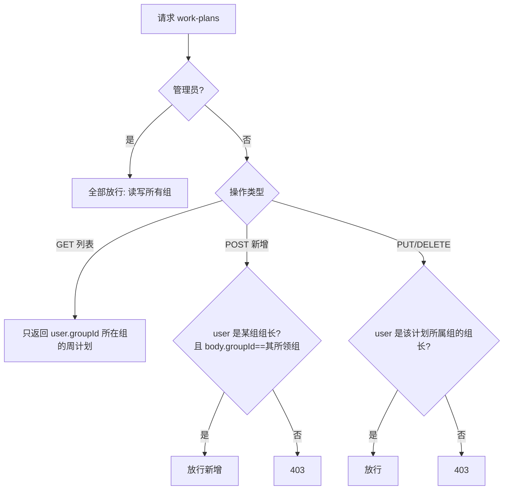
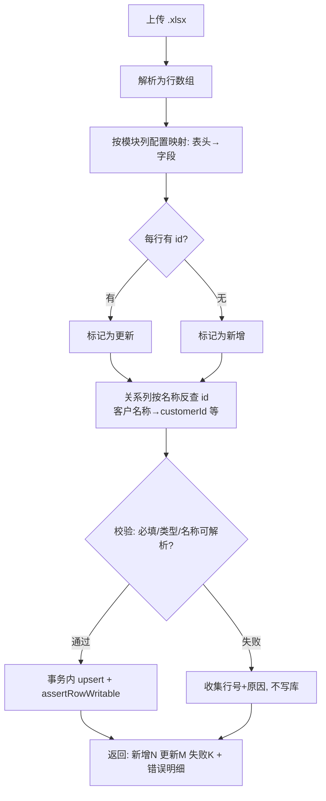

# 方案：组模块 + 工作计划三层重构 + 全模块导出/导入回写

> 状态：**待评审**（方案阶段，未执行）
> 日期：2026-06-05
> 技术栈：Next.js 16(App Router) + Prisma 7(`@prisma/adapter-pg`) + PostgreSQL + daisyUI 5 + ECharts + Vitest

---

## 1. 背景与需求

三个需求（来自用户反馈 + Excel 截图《交付一组-交付需求与计划管理表》）：

1. **全模块导出 → 修改 → 导入回写**：所有列表模块支持导出 Excel、改完再导回。导出含隐藏 `id` 列；导入时**有 id→更新、无 id→新增**；关系列（客户名称/岗位名称等）**按名称反查回 id**。当前导入全局下线（`IMPORT_ENABLED=false`），需重新启用。
2. **新增「组」模块**：建组、配成员、配组长。
3. **工作计划模块重构**：仅「组长」可新增；表单下拉选客户/岗位等；忠实截图的三层结构。

### 1.1 已确认决策（来自需求澄清）

| 决策点 | 结论 |
| --- | --- |
| 「组」与「部门」关系 | **组挂在部门之下**（层级）：部门 → 多个组，组有组长 + 成员 |
| 工作计划建模 | **忠实截图：三层**（周计划 → 明细行 → 组员分配矩阵） |
| 导入范围 | **所有列表模块都要（含工作计划）**，id-upsert + 关系列按名称解析 |
| 工作计划访问策略 | **组长写本组、组员读本组、管理员看全部** |
| 交付方式 | 一份方案、**分 3 阶段执行**（①组模块 ②工作计划 ③全模块导入） |
| 文档详略 | 含逻辑实现片段 |

### 1.2 设计假设（次要项，评审时确认或调整）

- **A1 组员基数**：一个用户**只属一个组**（`User.groupId`，与现有 `User.departmentId` 同构）。如需一人多组，改为关联表（本方案不采用）。
- **A2 组长归属**：组长必须是该组成员（`Group.leaderId` 指向一个 `groupId==本组` 的用户）；保存时校验。
- **A3 组管理权限**：组的增删改归**管理员**（与「部门/角色」一致，挂「系统管理」菜单），不进 `resources.ts` 资源表（部门/角色本就不是资源）。
- **A4 工作计划不做成标准权限资源**：其访问是**按组**而非按角色，故 `work-plans` 路由用**自定义组守卫**（非 `requirePermission`）；菜单对所有登录用户可见，内容按组过滤。
- **A5 计划日期为自由文本**：组员分配格 `planDates` 存文本（如 `6.1、6.3`），不解析为日期数组，保真且灵活。
- **A6 旧 work_plans 数据**：旧表仅基础 CRUD（title/owner/status…）、生产基本未用，重构时**重建表结构**（迁移脚本，见 §8）。

---

## 2. 数据模型（ER）



### 2.1 Prisma schema 变更（`prisma/schema.prisma`）

**新增 `Group`**：

```prisma
model Group {
  id           Int        @id @default(autoincrement())
  name         String     @db.VarChar(100)
  department   Department @relation(fields: [departmentId], references: [id])
  departmentId Int        @map("department_id")
  leader       User?      @relation("GroupLeader", fields: [leaderId], references: [id])
  leaderId     Int?       @map("leader_id")
  members      User[]     @relation("GroupMembers")
  workPlans    WorkPlan[]
  createdAt    DateTime   @default(now()) @map("created_at")
  updatedAt    DateTime   @updatedAt @map("updated_at")

  @@index([departmentId])
  @@map("groups")
}
```

**`Department` 增加反向关系**（一行）：`groups Group[]`

**`User` 增加成员关系 + 组长反向关系 + 分配反向关系**（在现有 `User` model 内追加）：

```prisma
  group          Group?               @relation("GroupMembers", fields: [groupId], references: [id])
  groupId        Int?                 @map("group_id")
  ledGroups      Group[]              @relation("GroupLeader")
  planAssignments WorkPlanAssignment[]
  // 注：现有 workPlans 关系将随 WorkPlan 重构改为「创建人」语义，见下
```

**重构 `WorkPlan`（删除旧字段，改三层）+ 新增 `WorkPlanItem` / `WorkPlanAssignment`**：

```prisma
model WorkPlan {
  id               Int            @id @default(autoincrement())
  group            Group          @relation(fields: [groupId], references: [id])
  groupId          Int            @map("group_id")
  weekStart        DateTime       @map("week_start") @db.Date  // 周一
  weekEnd          DateTime       @map("week_end")   @db.Date  // 周日
  deliveryStrategy String?        @map("delivery_strategy") @db.Text
  items            WorkPlanItem[]
  createdBy        User?          @relation("WorkPlanCreatedBy", fields: [createdById], references: [id])
  createdById      Int?           @map("created_by_id")
  createdAt        DateTime       @default(now()) @map("created_at")
  updatedAt        DateTime       @updatedAt @map("updated_at")

  @@index([groupId])
  @@index([createdById])
  @@map("work_plans")
}

model WorkPlanItem {
  id               Int                  @id @default(autoincrement())
  workPlan         WorkPlan             @relation(fields: [workPlanId], references: [id], onDelete: Cascade)
  workPlanId       Int                  @map("work_plan_id")
  customer         Customer?            @relation(fields: [customerId], references: [id])
  customerId       Int?                 @map("customer_id")
  requirement      Requirement?         @relation(fields: [requirementId], references: [id])
  requirementId    Int?                 @map("requirement_id")
  progressNote     String?              @map("progress_note") @db.Text
  positionOpenDate DateTime?            @map("position_open_date") @db.Date
  routineHunting   Boolean?             @map("routine_hunting")
  participation    Int?                 // 本周参与度
  sortOrder        Int                  @default(0) @map("sort_order")
  assignments      WorkPlanAssignment[]

  @@index([workPlanId])
  @@map("work_plan_items")
}

model WorkPlanAssignment {
  id        Int          @id @default(autoincrement())
  item      WorkPlanItem @relation(fields: [itemId], references: [id], onDelete: Cascade)
  itemId    Int          @map("item_id")
  member    User         @relation(fields: [memberId], references: [id])
  memberId  Int          @map("member_id")
  planDates String?      @map("plan_dates") @db.VarChar(100)  // 如 "6.1、6.3"

  @@unique([itemId, memberId])
  @@map("work_plan_assignments")
}
```

> `User` 现有 `workPlans WorkPlan[]` 关系名（默认）将与新 `WorkPlanCreatedBy` 冲突——需把现有 `workPlans WorkPlan[]` 行替换为 `createdWorkPlans WorkPlan[] @relation("WorkPlanCreatedBy")`。`Customer` / `Requirement` 各加一行反向关系 `workPlanItems WorkPlanItem[]`。

---

## 3. 权限设计（工作计划，按组）



- 新增权限助手 `src/lib/groups.ts`：`getMyGroupId(user)`、`getMyLedGroupId(user)`（`leaderId==user.id` 的组）、`assertCanWriteWorkPlan(user, groupId)`。
- `/api/permissions/my` 返回值增加 `groupId`、`ledGroupId`，前端 `useMyPermissions()` 暴露，工作计划页据 `ledGroupId!=null` 显示「新增周计划」。

---

## 4. 阶段一：组模块

### 步骤 1.1 — schema + 迁移
- 文件 `prisma/schema.prisma`：加 `Group`、`Department.groups`、`User.group/groupId/ledGroups`（§2.1 中与 Group 相关部分；WorkPlan 三层留到阶段二一起 push，**或**本阶段先只加 Group，阶段二再加工作计划三表——按 §8 迁移顺序）。
- 执行 `npx prisma generate`；本机/生产用 `psql` 跑 §8 的 `CREATE TABLE groups` + `ALTER TABLE users ADD COLUMN group_id`。
- **预期**：`groups` 表、`users.group_id` 列就位，`prisma generate` 无错。

### 步骤 1.2 — 组 API（管理员）
- 新文件 `src/app/api/groups/route.ts`：
  ```ts
  // GET 列表（全量 {data,total}，含 department/leader/members 计数）；POST 新增
  export async function GET() {
    await requireAdmin()
    const data = await prisma.group.findMany({
      orderBy: { createdAt: 'asc' },
      include: { department: { select: { id: true, name: true } },
                 leader: { select: { id: true, name: true } },
                 members: { select: { id: true, name: true } } },
    })
    return NextResponse.json({ data, total: data.length })
  }
  export async function POST(req: Request) {
    await requireAdmin()
    const { name, departmentId, leaderId, memberIds } = await req.json()
    // TODO 校验：name 必填；departmentId 存在；leaderId（若有）∈ memberIds（A2）
    const group = await prisma.group.create({ data: { name, departmentId, leaderId } })
    // 设置成员：把 memberIds 的 user.groupId 指向本组
    await prisma.user.updateMany({ where: { id: { in: memberIds ?? [] } }, data: { groupId: group.id } })
    return NextResponse.json({ data: group })
  }
  ```
- 新文件 `src/app/api/groups/[id]/route.ts`（`PUT`/`DELETE`，requireAdmin）：
  - `PUT`：更新 name/departmentId/leaderId；同步成员（把新成员 groupId 置本组，把「原属本组但已移出」的 groupId 置 null）。
  - `DELETE`：先把本组成员 groupId 置 null、再删组；若组下有 work_plans 则拒绝（外键保护）或级联说明。
- 新文件 `src/app/api/groups/options/route.ts`：仅登录，返回 `{id,name}` 供下拉。
- **预期**：组的增删改查 + 成员/组长配置可用，非管理员 403。

### 步骤 1.3 — 组管理页（管理员，挂「系统管理」）
- 新文件 `src/app/(dashboard)/settings/groups/page.tsx`：`BoostTable` + `Modal` 表单。
  - 列：组名 / 所属部门 / 组长 / 成员数 / 创建时间。
  - 表单字段：组名(input) / 所属部门(`SearchSelect` 走 `/api/departments`) / 成员(多选，`SearchSelect` 多选或多标签，走 `/api/users`) / 组长(`SearchSelect`，仅从已选成员里挑)。
- 文件 `src/app/(dashboard)/layout.tsx`：`GROUPS` 的「系统管理」组内加 `{label:'组管理', href:'/settings/groups'}`（管理员可见，沿用系统管理组的 admin 守卫）。
- **预期**：管理员能在「系统管理 → 组管理」建组、配人、设组长。

### 步骤 1.4 — 权限助手 + my 接口
- 新文件 `src/lib/groups.ts`：`getMyGroupId`、`getMyLedGroupId`、`assertCanWriteWorkPlan`。
- 改 `src/app/api/permissions/my/route.ts`：响应加 `groupId`、`ledGroupId`。
- 改 `src/lib/usePermissions.ts`：`useMyPermissions()` 暴露 `groupId`、`ledGroupId`。
- **预期**：前端可判断「我是不是某组组长」。

---

## 5. 阶段二：工作计划三层重构

### 步骤 2.1 — schema + 迁移
- `prisma/schema.prisma`：按 §2.1 重构 `WorkPlan` + 新增 `WorkPlanItem` / `WorkPlanAssignment`，修正 `User.workPlans → createdWorkPlans`，`Customer`/`Requirement` 加反向关系。
- §8 迁移：`work_plans` 重建（旧列 drop / 新列 add）、建 `work_plan_items`、`work_plan_assignments`。
- **预期**：三表就位，`prisma generate` 无错。

### 步骤 2.2 — 工作计划 API（组守卫）
- 改 `src/app/api/work-plans/route.ts`：
  ```ts
  export async function GET() {
    const user = await getCurrentUser(); if (!user) throw new HttpError(401,'未登录')
    const where = user.isAdmin ? {} : { groupId: getMyGroupId(user) ?? -1 }
    const data = await prisma.workPlan.findMany({
      where, orderBy: [{ weekStart: 'desc' }],
      include: { group: { select:{id:true,name:true} },
                 items: { include: { customer:{select:{id:true,shortName:true}},
                                     requirement:{select:{id:true,positionName:true}},
                                     assignments:{ include:{ member:{select:{id:true,name:true}} } } },
                          orderBy:{ sortOrder:'asc' } } },
    })
    return NextResponse.json({ data, total: data.length })
  }
  export async function POST(req: Request) {
    const user = await getCurrentUser(); if (!user) throw new HttpError(401,'未登录')
    const body = await req.json()
    assertCanWriteWorkPlan(user, body.groupId)  // 组长或管理员，否则 403
    // TODO 嵌套写：workPlan + items(create) + 每 item 的 assignments(create)
    // 解构剔除关系对象/id/时间戳；customerId/requirementId 空串→null；日期 new Date()
  }
  ```
- 新文件 `src/app/api/work-plans/[id]/route.ts`：`PUT`（`assertCanWriteWorkPlan(user, plan.groupId)` + `items` 用 `deleteMany:{} + create:[…]` 重写、assignments 同理）、`DELETE`（同守卫，级联删 items/assignments）。
- **预期**：组长能增删改本组周计划；组员 GET 只见本组；越权 403。

### 步骤 2.3 — 工作计划页重构（忠实截图）
- 改 `src/app/(dashboard)/work-plans/page.tsx`：
  - **列表**：`BoostTable` 列 = 组 / 周区间(weekStart~weekEnd) / 交付策略(截断) / 行数 / 创建人 / 更新时间。仅 `ledGroupId!=null`（或 admin）显示「新增周计划」。
  - **编辑视图**（`Modal` 宽屏或独立抽屉）：顶部 = 周区间(两个 date) + 本周交付策略(textarea)；下方 = **明细行编辑器**（参照截图的表格）：
    - 每行：客户(`SearchSelect`→`/api/clients/options`) / 岗位(`SearchSelect`→`/api/requirements/options`) / 交付进展(textarea) / 岗位开放时间(date) / 是否例行寻猎(是/否) / 本周参与度(number) / **组员日期矩阵**（动态列：本组成员，每格一个 input 填 `planDates` 文本）。
    - 行可增/删/排序；底部「小计」= 参与度求和 + 各成员被分配行数（前端计算，不入库）。
  - 组员列来源：按当前周计划的 `groupId` 拉该组成员（`/api/groups/[id]` 或新 `/api/groups/[id]/members`）。
- 复用现有 `SubTable` 思路实现明细行；矩阵单元格用受控 input。
- **预期**：UI 与截图结构一致，组长可编辑整张周计划表。

### 步骤 2.4 — 菜单与守卫调整
- `layout.tsx`：工作计划菜单从「仅管理员」改为「登录可见」（内容按组过滤；非组员看到空列表 + 提示）。
- **预期**：组员能看到本组工作计划页。

---

## 6. 阶段三：全模块导出/导入回写

### 6.1 导入流程



### 步骤 3.1 — 导出加隐藏 id + 关系名称列
- 改 `src/lib/exportExcel.ts`：导出首列固定 `id`（隐藏列或注明「请勿修改」），关系列导出**名称**（已是 accessor 的中文/名称值）。
- **预期**：导出的表可直接编辑后回导，`id` 用于回写匹配。

### 步骤 3.2 — 通用导入引擎（扁平模块）
- 新文件 `src/lib/importEngine.ts`：
  ```ts
  export interface ImportColumn {
    field: string; label: string
    required?: boolean
    type?: 'string'|'number'|'date'|'boolean'|'string[]'
    relation?: { resolve: (name: string) => Promise<number|null>; label: string } // 名称→id
  }
  export interface ImportResult { created: number; updated: number; failed: number; errors: {row:number;msg:string}[] }
  // 解析 + 校验 + 关系解析 + 分组(有/无 id)
  export async function parseAndValidate(rows: any[], cols: ImportColumn[]): Promise<...>
  ```
- 每个扁平模块声明列配置（放在各自 `src/lib/<module>Import.ts` 或集中 `src/lib/importConfigs.ts`），关系解析器用「名称唯一匹配，重名/查无 → 该行报错」。
- 通用导入端点：每模块 `src/app/api/<resource>/import/route.ts` 的 `POST`：
  - `requirePermission(resource,'IMPORT')`；
  - 事务内逐行 upsert，更新前 `assertRowWritable`，新增置 `createdById`；
  - 返回 `ImportResult`。
- **预期**：候选人/客户/需求/人才库/商机/合同/联系人/知识库 可导出→改→导回，id-upsert + 名称解析。

### 步骤 3.3 — 工作计划专用导入（主从-矩阵）
- 导出：一行 = 一个 `WorkPlanItem`，列 = `[workPlanId, itemId(隐藏), 组, weekStart, weekEnd, 交付策略, 客户名称, 岗位名称, 交付进展, 岗位开放时间, 是否例行寻猎, 本周参与度, <成员1>, <成员2>…]`，成员列表头=成员名、格=`planDates`。
- 新文件 `src/app/api/work-plans/import/route.ts`：按 `workPlanId`（或 组+周）聚合行 → 重建 master + items + assignments（成员列名→该组成员 userId）；`assertCanWriteWorkPlan` 守卫。
- **预期**：截图那张表可导出、改、导回。

### 步骤 3.4 — 重新启用导入 UI
- 改 `src/components/ui/BoostTable.tsx`：`IMPORT_ENABLED = true`；`onImport` 触发导入弹窗（文件选择 → POST → 展示 `ImportResult` 与错误明细）。
- 新文件 `src/components/ui/ImportModal.tsx`：上传 + 结果展示组件。
- 各列表页 `onImport` 接到对应 `/api/<resource>/import` + 列配置。
- 改 `src/lib/resources.ts`：`IMPORT` 动作已存在，恢复其在权限设置 UI 的可见性（若之前隐藏）。
- **预期**：所有列表页出现「导入」按钮（受 `IMPORT` 权限控制），可回写。

---

## 7. 测试方案（遵循 testing-plan-rule）

**框架**：Vitest 4（现有）。单元测试放 `src/**/__tests__/`；API route 测试沿用「mock `@/lib/permissions` + `@/lib/prisma`」的现有套路。

| 功能点 | 用例（输入 → 预期） | 边界/异常 |
| --- | --- | --- |
| 组 API | 管理员建组+配成员 → 成员 `groupId` 更新；非管理员 → 403 | leaderId 不在 memberIds → 400；删除有 work_plan 的组 → 拒绝 |
| 权限助手 | `getMyLedGroupId`：组长返回组 id、非组长返回 null | 用户无组 → groupId=null |
| 工作计划 GET | 组员只见本组；管理员见全部 | 无组用户 → 空列表 |
| 工作计划 POST | 组长建本组计划 → 201 | 非组长/跨组 → 403；嵌套 items+assignments 正确写入 |
| 工作计划 PUT/DELETE | 组长改本组 → OK | 改别组 → 403 |
| 导入引擎 `parseAndValidate` | 有 id→更新、无 id→新增；客户名称→id | 重名客户→该行报错；必填空→报错；类型错→报错 |
| 模块导入端点 | 混合「2 更新 + 1 新增 + 1 错误」→ `{updated:2,created:1,failed:1,errors:[…]}` | 全部失败时不写库（事务回滚）；无 IMPORT 权限→403；更新他人数据→`assertRowWritable` 403 |
| 工作计划导入 | 多行同 workPlanId 聚合重建 master+items+assignments | 成员列名解析不到组员→报错 |

**手动验证（UI / 无法自动化）**：
1. 系统管理→组管理：建「交付部/交付一组」、配成员、设组长 → 列表正确。
2. 以组长登录：工作计划「新增周计划」，按截图填 1 张表（含成员日期矩阵）→ 保存 → 列表/明细回显一致；小计正确。
3. 以组员登录：能看到本组该周计划、无「新增」按钮；改不动（PUT 403）。
4. 任一列表页：导出 → Excel 改两行(含一行清空 id 当新增) + 改关系列名称 → 导入 → 校验结果与库一致。
5. 工作计划导出→改→导回 → 三层数据一致。

**门控**：`npx tsc --noEmit` 0 错、`npm run lint` 干净、`npm test` 全绿、`npm run build` 成功。禁止改测试用例来凑通过。

---

## 8. 数据迁移与回滚

> Prisma 7 + adapter-pg 下 `prisma db push` 对破坏性变更受限，**生产用 `psql` 跑定向 DDL**（本机可 `prisma db push`）。本机改完 schema 先 `npx prisma generate`。

**阶段一 DDL**（幂等保护）：
```sql
CREATE TABLE IF NOT EXISTS groups (
  id SERIAL PRIMARY KEY, name VARCHAR(100) NOT NULL,
  department_id INT NOT NULL REFERENCES departments(id),
  leader_id INT REFERENCES users(id),
  created_at TIMESTAMP DEFAULT now(), updated_at TIMESTAMP DEFAULT now()
);
ALTER TABLE users ADD COLUMN IF NOT EXISTS group_id INT REFERENCES groups(id);
CREATE INDEX IF NOT EXISTS idx_groups_department ON groups(department_id);
```

**阶段二 DDL**（work_plans 重建——旧表基本未用，A6）：
```sql
-- 旧列清理（若存在）
ALTER TABLE work_plans
  DROP COLUMN IF EXISTS title, DROP COLUMN IF EXISTS owner_id,
  DROP COLUMN IF EXISTS start_date, DROP COLUMN IF EXISTS end_date,
  DROP COLUMN IF EXISTS status, DROP COLUMN IF EXISTS notes;
-- 新列
ALTER TABLE work_plans
  ADD COLUMN IF NOT EXISTS group_id INT REFERENCES groups(id),
  ADD COLUMN IF NOT EXISTS week_start DATE,
  ADD COLUMN IF NOT EXISTS week_end DATE,
  ADD COLUMN IF NOT EXISTS delivery_strategy TEXT,
  ADD COLUMN IF NOT EXISTS created_by_id INT REFERENCES users(id);
CREATE TABLE IF NOT EXISTS work_plan_items ( … 见 §2.1 … );
CREATE TABLE IF NOT EXISTS work_plan_assignments ( … 见 §2.1 …, UNIQUE(item_id, member_id) );
```
> 迁移前用 `SELECT count(*) FROM work_plans;` 确认旧数据量；若有真实旧数据，先导出备份再 drop。

**回滚**：阶段独立，失败可 `DROP TABLE` 新表 / `ALTER … DROP COLUMN` 回退；代码用 git 回退到阶段前提交。破坏性 DDL（drop 列）执行前先 `pg_dump` 相关表。

---

## 9. 文档同步（执行收尾必做）

- `AGENTS.md`：新增「组/工作计划」章节（组挂部门下、工作计划三层与按组权限、导入引擎与名称解析约定）；菜单分组说明加「组管理」。
- `README.md`：项目结构补 `groups`/`work_plan_*` 表与导入引擎；功能清单更新工作计划。
- `docs/数据字典.md`：补 `groups` / `work_plans`(新) / `work_plan_items` / `work_plan_assignments`。
- `src/components/ui/GUIDE.md`：补「导入」用法（ImportModal + 列配置）。

---

## 10. 执行建议（分阶段）

顺序执行（阶段间有依赖：②依赖①的组与权限助手；③依赖①②的实体与表单）：
1. **阶段一（组模块）** → 验收（建组/配人/设组长 + 测试）→ 提交。
2. **阶段二（工作计划三层）** → 验收（组长建表、组员只读、UI 对齐截图）→ 提交。
3. **阶段三（全模块导入）** → 验收（扁平模块 + 工作计划回写）→ 提交。

阶段内部分步骤可并行（如阶段三各扁平模块的列配置互相独立，可并行交给 `requirement-plan-executor` 子代理；schema/迁移类共享文件须串行）。**执行须等用户明确「执行」指令**。

---

## 11. 方案自审

- [x] 需求全覆盖：①全模块导入 ②组模块 ③工作计划三层重构 均有对应阶段与步骤。
- [x] 无 TBD/「后续实现」占位（代码骨架内 `TODO 注释` 仅用于描述复杂逻辑步骤，符合规范）。
- [x] 步骤含精确文件路径 + 预期结果；阶段依赖明确（①→②→③）。
- [x] 含测试章节（单测 + 集成 + 边界 + 手动验证 + 门控）。
- [x] 含 Mermaid（ER + 权限流程 + 导入流程）与表格（决策/测试/列配置）。
- [x] 代码片段遵循项目规则：列表 GET 返全量 `{data,total}`、写操作 `assertRowWritable`、下拉走 `/options`、`SearchSelect`、HttpError 统一错误、Prisma adapter 不写 url、生产 DDL 用 psql。
- [ ] **待用户确认**：§1.2 假设 A1–A6（尤其 A1 一人一组、A3 组管理归管理员、A6 旧 work_plans 重建）。

---

> 评审通过并收到「执行」指令后，按 §10 顺序执行；执行中如遇与方案冲突立即停并回写本文档。
