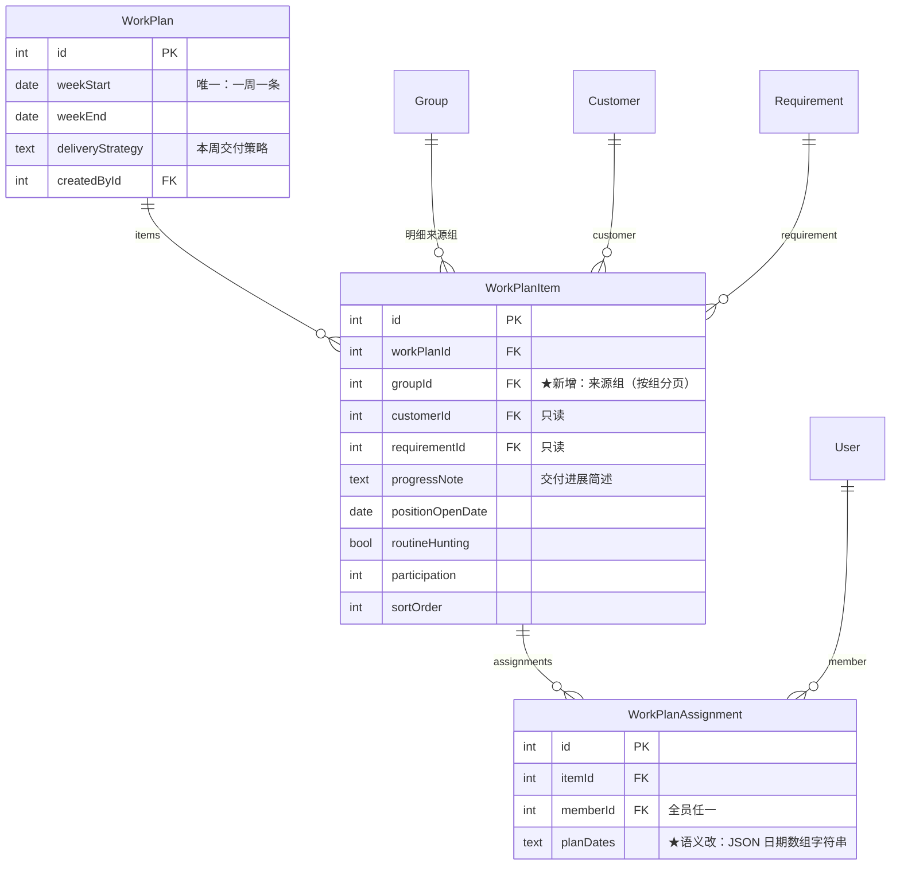
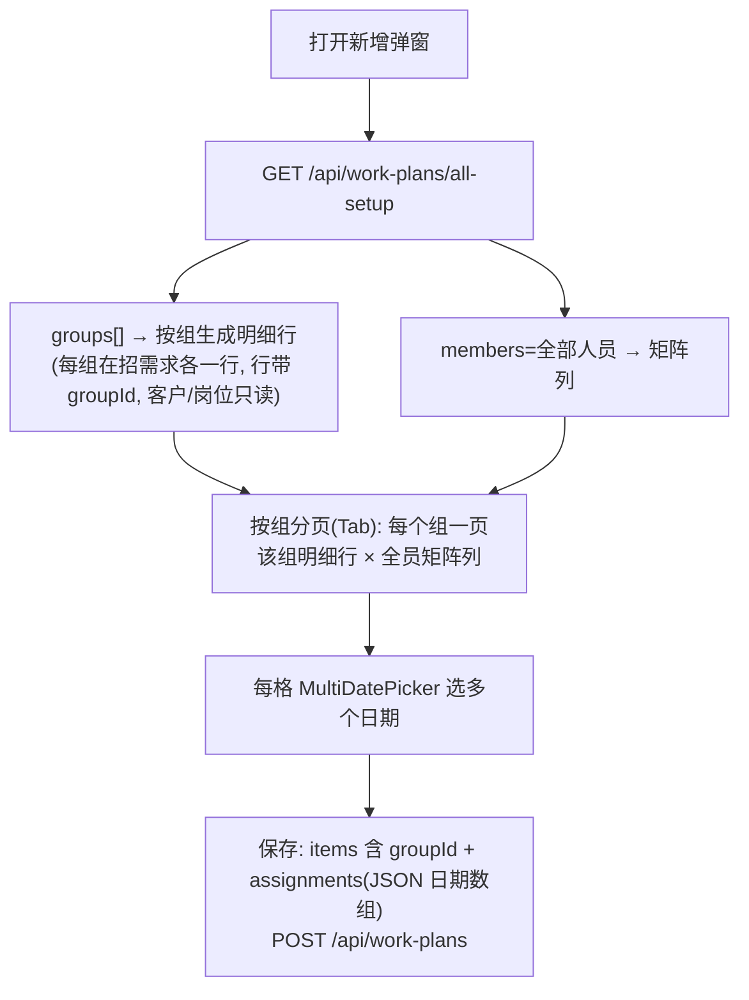

# 方案：工作计划改造（一周一条 · 全部组 · 全员矩阵 · 纳入权限）

> 状态：**已完成** ✅（schema/权限/后端/前端/测试全部落地；tsc/eslint/585 测试/build 全过；preview 实测验证全员矩阵+按组分页+全屏+日期多选+唯一周+上周进展带入。分支 `feature/work-plan`，**待部署 39**）
> 日期：2026-06-15　分支：`feature/work-plan`
> 前置：`doc/plans/2026-06-05-组与工作计划重构-全模块导入.md`（基础实现，已全部完成 ✅）。本方案在其之上改造。
> 文档粒度：**仅结构声明**（类/函数签名、数据结构；不含方法体实现）。

---

## 1. 背景与需求

工作计划三层（`WorkPlan` 周计划 → `WorkPlanItem` 明细行 → `WorkPlanAssignment` 组员日期矩阵）已落地，现按客户实际使用反馈改造。客户给的 7 条需求：

| # | 需求 | 性质 |
| --- | --- | --- |
| 1 | 新增时「本周计划岗位（组员）」矩阵列显示**全部人员**（非仅本组组员） | 数据来源 |
| 2 | 组员格输入框改为**日期控件、支持多选**（一格可多个日期） | 控件 |
| 3 | 明细的**客户名称（预留 6 字宽）+ 岗位名称改为只读**（不下拉改） | 控件 |
| 4 | 整个新增工作计划弹窗**铺满屏幕** | 布局 |
| 5 | 明细「交付进展简述」**拉宽 + 可换行撑高本行** | 布局 |
| 6 | 一条记录可以处理**全部组**的工作计划（不再每组一条） | 架构 |
| 7 | 岗位**按组分页**展示 | 布局 |

### 1.1 已确认决策（需求澄清阶段）

| 决策点 | 结论 |
| --- | --- |
| 数据模型（需求 6 落地） | **方案 A 真合并**：周计划全公司一周一条；明细行带 `groupId` 标记来源组（用于按组分页）。存量数据 0，迁移零成本。 |
| 跨组编辑权（需求 6） | **纳入权限体系**：新增业务资源 `WORK_PLAN`（查看/新增/编辑/删除），管理员在「权限设置」按矩阵授权。取消旧「组长写本组」。 |
| 分页矩阵列（需求 1 × 7） | 按组分页时，**每页都显示全部人员**列。 |
| 明细来源（需求 3） | 明细**全自动生成**（按所有组在招需求），**不能手动加行**；客户/岗位纯只读。 |
| 日期多选存储（需求 2） | `WorkPlanAssignment.planDates` 维持 `String` 列，约定存 **JSON 数组字符串**（ISO 日期，如 `["2026-06-02","2026-06-03"]`）；空不入库（稀疏）。 |
| 导入/导出 | `WORK_PLAN` **不含导入/导出动作**；顺势**移除**旧的工作计划矩阵导入/导出（`workPlanImport.ts`、`/api/work-plans/import`、页面 `onExport`/`importResource`）。 |

---

## 2. 现状（改造起点）

| 层 | 现状 | 关键文件 |
| --- | --- | --- |
| schema | `WorkPlan.groupId`（必填、单组）；`WorkPlanItem` 无 groupId；`WorkPlanAssignment.planDates` 自由文本 | `prisma/schema.prisma` |
| 列表 GET | 管理员看全部、其他人按 `groupId` 过滤 | `src/app/api/work-plans/route.ts` |
| 写 | `assertCanWriteWorkPlan`（组长写本组） | `src/lib/groups.ts`、`route.ts`、`[id]/route.ts` |
| 选组初始化 | `group-setup`：拉**本组**成员 + 本组在招需求 + 本组上周进展 | `src/app/api/work-plans/group-setup/route.ts` |
| 嵌套写映射 | `buildItemCreate`、`WORK_PLAN_INCLUDE` | `src/lib/workPlanData.ts` |
| 页面 | 选组 → 拉本组成员/需求 → 明细+矩阵编辑器；矩阵格为文本 input | `src/app/(dashboard)/work-plans/page.tsx` |
| 权限/菜单 | 无独立资源；菜单项继承（管理员/组长可见） | `src/lib/resources.ts`、`(dashboard)/layout.tsx` |
| 导入/导出 | `workPlanImport.ts` 按「组+周」聚合重建；页面自定义 `onExport` | `src/lib/workPlanImport.ts`、`api/work-plans/import/route.ts` |

---

## 3. 数据模型设计（方案 A）

### 3.1 ER（改造后）



### 3.2 schema 改动清单（`prisma/schema.prisma`，仅结构）

- **`WorkPlan`**：
  - 删除 `group`/`groupId` 关联与 `@@index([groupId])`。
  - 新增唯一约束 `@@unique([weekStart])`（一周一条）。
  - 其余字段不变。
- **`WorkPlanItem`**：
  - 新增 `group Group @relation("WorkPlanItemGroup", fields: [groupId], references: [id])` + `groupId Int @map("group_id")`。
  - 新增 `@@index([groupId])`。
- **`WorkPlanAssignment`**：列定义不变（`planDates String?`），仅**语义**变为「JSON 日期数组字符串」。
- **`Group`**：把反向关联 `workPlans WorkPlan[]` 改为 `workPlanItems WorkPlanItem[]`（指向新关系名）。

### 3.3 迁移（DDL，手工 `psql`；存量为 0）

- `ALTER TABLE work_plan_items ADD COLUMN group_id int;`（回填：本地/生产均空，无需回填；随后置 NOT NULL + 外键 + 索引）。
- `ALTER TABLE work_plans DROP COLUMN group_id;`（先确认 `work_plans` 计数为 0）。
- `CREATE UNIQUE INDEX work_plans_week_start_key ON work_plans(week_start);`
- 外键/索引：`work_plan_items.group_id → groups.id`、`CREATE INDEX work_plan_items_group_id_idx`。

> 执行前预演：先 `SELECT count(*) FROM work_plans;` 确认为 0 再 DROP（一致性门控；非 0 则停下报告，按方案 A 补「旧 `groupId` 回填到各 item」的迁移分支）。

---

## 4. 权限纳入体系（`WORK_PLAN` 资源）

### 4.1 `src/lib/resources.ts`（结构）

- `RESOURCES` 追加一项：`{ key: 'WORK_PLAN', label: '工作计划', path: 'work-plans' }`。
- 新增导出常量：`NO_IO_RESOURCES: ResourceKey[] = ['WORK_PLAN']`（标记「无导入/导出」的业务资源，供权限矩阵裁剪 IMPORT/EXPORT 列）。

### 4.2 后端守卫

- `route.ts`：`GET` → `requirePermission('WORK_PLAN','VIEW')`；`POST` → `requirePermission('WORK_PLAN','CREATE')`。**去掉** `assertCanWriteWorkPlan` 与按组 `where` 过滤（有 VIEW 看全部）。
- `[id]/route.ts`：`GET`=VIEW、`PUT`=EDIT、`DELETE`=DELETE；**不加** `assertRowWritable`（决策：有权限者改整条）。
- `src/lib/groups.ts`：`assertCanWriteWorkPlan` 不再被工作计划路由引用——**保留** `getMyGroupId`/`getMyLedGroupId`（`permissions/my` 仍用），删除 `assertCanWriteWorkPlan`（确认无其它引用后）。

### 4.3 权限矩阵页（`(dashboard)/settings/permissions/page.tsx`）

- 渲染业务资源动作列时，对 `NO_IO_RESOURCES` 内资源**裁剪掉 IMPORT/EXPORT**两列（其余 4 动作正常）。结构同系统资源裁剪逻辑。

### 4.4 菜单显隐（`(dashboard)/layout.tsx`）

- 工作计划菜单项由「继承/管理员组长可见」改为 `can('WORK_PLAN','VIEW')` 控制。

---

## 5. API 改造

### 5.1 列表与写（`route.ts` / `[id]/route.ts`）

- 见 4.2 守卫。`POST` body 去掉 `groupId`；新增唯一周校验（命中 `@@unique([weekStart])` 时返回 409「本周计划已存在」）。
- `items[]` 每行新增 `groupId`（前端按来源组带上）。

### 5.2 全员/全组初始化接口（替换 `group-setup`）

- **新增** `GET /api/work-plans/all-setup`（`route.ts`），返回结构：

```ts
type AllSetup = {
  members: { id: number; name: string }[]            // 需求1：全部人员（矩阵列）
  groups: {
    groupId: number
    groupName: string
    requirements: {                                   // 该组在招需求（每岗位一行）
      requirementId: number
      positionName: string
      customerId: number | null
      customerShortName: string
      positionOpenDate: string | null
    }[]
  }[]
  lastProgress: Record<string, string>                // "customerId:requirementId" → 上周非空进展
}
```

- 复用现有「在招」过滤口径（`status` 含任一非『关闭/暂停』）；`members` 取全部用户；`groups` 遍历所有组、各拉本组成员录入的在招需求；`lastProgress` 取上一周（按 `weekStart desc`）全量明细的非空进展。
- **删除** `group-setup/route.ts`。

### 5.3 嵌套写映射（`src/lib/workPlanData.ts`，结构）

- `buildItemCreate(it, index)`：返回对象新增 `groupId: Number(it.groupId)`；`assignments` 的 `planDates` 由「非空字符串」改为「**非空 JSON 数组**」过滤与序列化（`string[] → JSON.stringify`，空数组跳过）。
- `WORK_PLAN_INCLUDE`：`items.include` 增加 `group: { select: { id: true, name: true } }`；去掉顶层 `group`。

### 5.4 移除工作计划导入/导出

- 删除 `src/lib/workPlanImport.ts`、`src/app/api/work-plans/import/route.ts`。
- 页面移除自定义 `onExport`、`importResource`（见 §6）。

---

## 6. 前端改造（`(dashboard)/work-plans/page.tsx` + 新组件）

### 6.1 编辑器数据流（需求 1/3/6/7）



- **状态结构**（仅声明）：`ItemRow` 增加 `groupId: number`、`groupName: string`；`assignments: Record<string, string[]>`（memberId → 日期数组）。按 `groupId` 分组渲染为 Tab 页。
- **明细只读**（需求 3）：删除客户/岗位下拉，渲染为只读文本；客户名容器固定约 6 字宽（`w-[6em]`/`min-w` + 截断 tooltip）。
- **不可手动加行**（决策）：移除「加一行」按钮；明细完全由 `all-setup` 生成。
- **按组分页**（需求 7）：daisyUI `tabs`，每个 `groupId` 一个 tab，标题=组名；每页矩阵列恒为全员（需求 1）。

### 6.2 新组件 `src/components/ui/MultiDatePicker.tsx`（需求 2，仅签名）

```tsx
interface MultiDatePickerProps {
  value: string[]                 // ISO 日期数组
  onChange: (next: string[]) => void
  readOnly?: boolean
  max?: number                    // 可选上限
}
export function MultiDatePicker(props: MultiDatePickerProps): JSX.Element
```

- 行为：已选日期以 chip 列表展示、可删；底部一个 `type="date"` 选择器追加（去重、排序）。编排风格对齐既有 `MultiFileUpload`。在 `src/components/ui/index.ts` 导出。

### 6.3 全屏弹窗（需求 4，`src/components/ui/Modal.tsx`，仅签名）

- `ModalProps` 增加 `size?: 'md' | 'full'`（默认 `md` = 现状）。
- `full`：外层容器 `p-2`、面板 `max-w-[96vw] w-[96vw]`、内容区 `max-h-[88vh]`（替代固定 `max-h-[70vh]`）。工作计划编辑弹窗传 `size="full"`。

### 6.4 交付进展（需求 5）

- 该列单元格用 `textarea`（替代 input）：`w-full min-w-[16rem]`、`rows` 自适应（随内容换行撑高本行）、`resize-y`。

### 6.5 列表页

- 行操作维持「详情 → 编辑」模式；`onEdit` 权限口径由 `canWriteRow` 改为 `can('WORK_PLAN','EDIT')`；删除按 `can('WORK_PLAN','DELETE')`。
- 移除 `importResource` 与自定义 `onExport`（§5.4）。

---

## 7. 测试

测试框架：**Vitest**（既有）。后端 route/lib 用单测 + mock `@/lib/prisma`、`@/lib/permissions`（沿用现有风格）；前端交互用**手动验证**（dev 预览）。遵循 `dofunc-team-rules:testing-plan-rule`：每功能点 + 边界均有用例，不靠改用例凑绿。

### 7.1 单元测试

| 文件 | 用例 | 断言/边界 |
| --- | --- | --- |
| `src/lib/__tests__/workPlanData.test.ts`（改） | `buildItemCreate` 带 `groupId`；`assignments` 入参 `string[]` → 序列化为 JSON | 空数组格被跳过（稀疏）；`groupId` 透传为数字；`planDates` = `JSON.stringify(arr)` |
| `src/app/api/work-plans/__tests__/route.test.ts`（改/增） | `GET` 无 `WORK_PLAN:VIEW`→403；有→看全部（不按组过滤）。`POST` 无 `CREATE`→403；重复周→409；成功创建含多组 items | 关键安全：无权限 403、不写库；唯一周冲突 409 |
| `src/app/api/work-plans/[id]/__tests__/route.test.ts`（改/增） | `PUT` 需 `EDIT`、`DELETE` 需 `DELETE`；**非创建者但有权限可改**（无 `assertRowWritable`） | 无权限 403；有权限放行（验证决策） |
| `src/app/api/work-plans/all-setup/__tests__/route.test.ts`（新） | 返回 `members`=全部用户；`groups[]` 各含本组在招需求；`lastProgress` 取上周非空 | 无组/无在招需求时 `groups`/`requirements` 为空数组（不报错）；未登录 401 |
| `src/lib/__tests__/permissions.test.ts`（改） | `WORK_PLAN` 纳入 `ALL_RESOURCE_KEYS`、`hasAction('WORK_PLAN',…)` 正常 | `NO_IO_RESOURCES` 不含 IMPORT/EXPORT 行为符合预期 |

### 7.2 边界与安全

- 权限：无 `WORK_PLAN` 任意动作的登录用户，对应 GET/POST/PUT/DELETE 全 403，且不触发写库。
- 唯一周：同 `weekStart` 二次 `POST` → 409，不产生第二条。
- 稀疏矩阵：未选日期的格不入 `work_plan_assignments`。
- 空集合：公司无组 / 某组无在招需求 → `all-setup` 返回空数组，前端正常渲染空页。
- 一致性门控：迁移前 `work_plans` 计数必须为 0（非 0 停下报告）。

### 7.3 手动验证（UI，dev 预览）

1. 新增弹窗**铺满屏幕**（需求 4）。
2. 矩阵列为**全部人员**（需求 1）；按组 **Tab 分页**、每页全员列（需求 7）。
3. 客户/岗位**只读**、客户名约 6 字宽（需求 3）；**无「加一行」**。
4. 组员格为**日期多选**、可多日期、可删（需求 2）。
5. 交付进展**可换行撑高**本行（需求 5）。
6. 保存后列表出现该周一条；详情回显多组明细与日期数组。
7. 权限：在「权限设置」给某账号配/撤 `WORK_PLAN` 各动作，菜单与按钮随之显隐、接口 403 生效。

### 7.4 门控（提交前）

`npx tsc --noEmit` 0 错 → `npx eslint` 干净 → `npm test` 全绿 → `npm run build` 成功。

---

## 8. 执行步骤（顺序）

> 多步存在依赖（schema → 引擎 → API → 前端），建议**顺序执行**；可由 `requirement-plan-executor` 子代理（Sonnet）逐步执行、当前会话调度监控。破坏性 DDL（DROP COLUMN）先预演计数确认。

1. **schema + 迁移**：改 `schema.prisma`（§3.2）→ `npx prisma generate` → 本地 `psql` 跑 DDL（§3.3，先确认计数 0）。
2. **权限资源**：`resources.ts` 加 `WORK_PLAN` + `NO_IO_RESOURCES`（§4.1）；权限矩阵页裁剪（§4.3）。
3. **后端**：`workPlanData.ts`（§5.3）→ `route.ts`/`[id]/route.ts` 守卫与字段（§5.1）→ 新 `all-setup`、删 `group-setup`（§5.2）→ 删工作计划导入（§5.4）→ `groups.ts` 清理（§4.2）。
4. **前端**：`Modal` 加 `size`（§6.3）→ 新 `MultiDatePicker`（§6.2）→ `work-plans/page.tsx` 重构（§6.1/6.4/6.5）→ `layout.tsx` 菜单（§4.4）。
5. **测试**：按 §7 增改单测 → 门控（§7.4）→ 手动验证（§7.3）。
6. **提交**：分支 `feature/work-plan` 提交；**部署单列**（DDL + 产物，部署时确认 39 `work_plans=0`，属用户授权的生产操作）。

---

## 9. 自审

- [x] **需求覆盖**：1 全员矩阵、2 日期多选、3 只读+6字宽、4 全屏、5 进展撑高、6 一周一条全部组、7 按组分页——逐条对应章节。
- [x] **无占位符**：无 TBD/TODO；精简模式按约定只给结构声明。
- [x] **依赖清晰**：schema → 引擎/API → 前端 → 测试，顺序与门控明确。
- [x] **测试/验证**：单测覆盖权限/唯一周/稀疏/空集合 + 手动 7 项。
- [x] **规则符合**：业务资源单一事实源加 `WORK_PLAN`；route 独立鉴权（不靠前端）；`HttpError` 统一抛错；DB 变更手工 `psql`；导出下拉/选项接口口径不变。
- [x] **连带影响**：移除旧工作计划导入/导出（与「无导入导出」一致）；`Group` 反向关联改名；`assertCanWriteWorkPlan` 退役。
- [x] **用户已确认**（2026-06-15）：① **移除**工作计划的导入/导出能力（与「无导入导出」一致）；② **一周一条**、加 `@@unique([weekStart])` 唯一约束。
